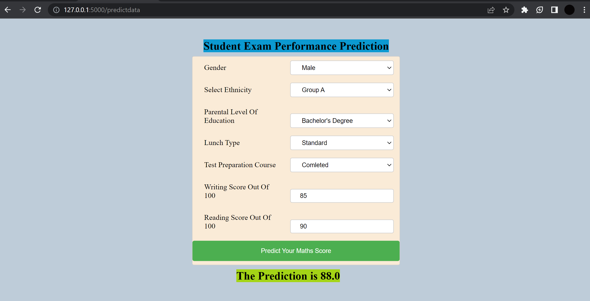

# Students Performance Prediction Project

### Introduction About The Data :

**The Dataset** The goal is to predict 'Maths Score' of student.

There are 7 independent variables :

* 'gender' : sex of students -> (Male/Female)
* 'race/ethnicity' : ethnicity of student -> (Group A, B, C, D, E)
* 'parent level of education' : parent's final education -> (bachelor's degree, some college, master's degree, associate's degree, high school)
* 'lunch' : having lunch before test -> (standard or free/reduced)
* 'test preparation course' : completed or not completed before test
* 'reading score' : reading score of both students
* 'writing score' : writing score of both students

Targer Variable:
* 'math score'

Dataset source link:
https://www.kaggle.com/datasets/spscientist/students-performance-in-exams?datasetId=74977

# Screenshot of UI

# Approach for the project

1. Data Ingestion :
    * In Data Ingestion phase the data is first read as csv.
    * Then the data is split into training and testing and saved as csv file.

2. Data Transformation :
    * In this phase a ColumnTransformer Pipeline is created.
    * For Numeric Variables first SimpleImputer is applied with strategy median, then Standard Scaling is performed on Numeric Data.
    * For Categorical Variables SimpleImputer ia applied with most frequent strategy, then ordinal encoding performed, after this data is scaled with Standard Scaler.
    * This preprocessor is saved as pickel file.

3. Model Trainig :
    * In this phase lots of model trained. (Linear Regression, Randon Forest Regressor,KNN, Decision Tree, etc.,)
    * After the hyperparameter tuning the best model found was Linear Regression.
    * This model is saved as pickle file.

4. Prediction Pipelie :
    * This pipeline converts given data into dataframe and various functions to load pickle files and predict the final results the python.

5. Flask App Creation :
    * Flask app is created with User Interface to predict the maths score inside a Web Application.